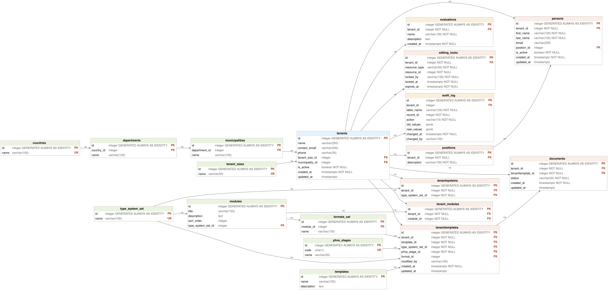

# Modelo Físico — SST-PESV

> Decisiones técnicas para la implementación DDL en PostgreSQL 16.
> Sesión 1.4 — Preparación para DDL.
> **NO contiene DDL.** Solo documenta decisiones listas para traducirse a `CREATE TABLE`, `CREATE INDEX`, etc.



> Diagrama físico: tipos PostgreSQL 16 reales por columna (`integer GENERATED ALWAYS AS IDENTITY` en todas las PK, `NOT NULL` donde corresponde). Acciones `ON DELETE` documentadas en §4.2, índices en §7. `tenanttemplates.modified_by` refleja la migración `005_alter_tenanttemplates.sql` (Sesión 3.4).

---

## 1. Alcance

Este documento define las decisiones del modelo físico para la base de datos multi-tenant SST/PESV en PostgreSQL 16.

**Fuentes:**
- `Examen.md` (fuente primaria de requisitos)
- `docs/modelo_conceptual.md` (entidades y relaciones)
- `docs/modelo_logico.md` (tablas, columnas, tipos lógicos)
- `docs/requerimientos.md` (inventario de consultas, procedimientos, funciones, triggers)
- `TASKS.md` (restaurado, con INC-01 documentado)

**NO incluye:**
- DDL (`CREATE TABLE`, `ALTER TABLE`, `CREATE INDEX`, etc.)
- Datos de prueba
- Scripts ejecutables

---

## 2. Convenciones de nombres

| Elemento | Convención | Ejemplo |
|---|---|---|
| Tablas | snake_case, plural | `tenants`, `persons`, `tenant_modules` |
| Columnas | snake_case | `tenant_id`, `created_at`, `first_name` |
| PK | `id` | `id` en todas las tablas |
| FK | `{entidad}_id` | `tenant_id`, `module_id`, `position_id` |
| Constraints UNIQUE | `uq_{tabla}_{columna(s)}` | `uq_countries_name`, `uq_tenant_modules_tenant_module` |
| Constraints CHECK | `ck_{tabla}_{campo}` | `ck_documents_status`, `ck_audit_log_action` |
| Índices | `ix_{tabla}_{columna(s)}` | `ix_persons_tenant_id`, `ix_audit_log_table_record` |
| Vistas | `vw_{descripción}` | `vw_tenant_persons`, `vw_tenant_geography` |
| Vistas materializadas | `vm_{descripción}` | `vm_template_pesv_docs_summary` |
| Triggers | `trg_{tabla}_{evento}_{descripción}` | `trg_tenants_updated_at`, `trg_documents_audit` |
| Funciones | `fn_{descripción}` | `fn_tenant_person_count`, `fn_compliance_pct` |
| Procedimientos | `sp_{descripción}` | `sp_create_tenant`, `sp_assign_template` |

**Nota sobre nombres de tablas del examen:** Se conservan los nombres exactos utilizados en `Examen.md` (`tenants`, `persons`, `positions`, `tenant_sizes`, `type_system_sst`, `countries`, `editing_locks`, `formats_sst`, `tenant_modules`, `tenantsystems`, `tenanttemplates`) para mantener trazabilidad directa con el enunciado.

---

## 3. Tipos de datos PostgreSQL

### 3.1 Identificadores

| Uso | Tipo PostgreSQL | Justificación |
|---|---|---|
| PK de todas las tablas | `integer GENERATED ALWAYS AS IDENTITY` | Más limpio que `serial`; evita secuencias huérfanas |
| FKs | `integer` | Consistente con PK `integer` |
| `resource_id` en `editing_locks` | `integer` | Referencia genérica a cualquier tabla |

**Nota:** Se usa `integer` en lugar de `biginteger` porque el volumen esperado de datos (organizaciones, personas, módulos) no justifica `bigint`. Si el proyecto creciera, se podría migrar.

### 3.2 Textos

| Campo | Tipo | Longitud | Justificación |
|---|---|---|---|
| Nombres de países/departamentos/municipios | `varchar(100)` | 100 | Nombres geográficos raramente superan 100 caracteres |
| Nombre de organización (`tenants.name`) | `varchar(200)` | 200 | Razones sociales pueden ser largas |
| Correos electrónicos | `varchar(200)` | 200 | Estándar para emails |
| Teléfonos | `varchar(30)` | 30 | Soporta formato internacional |
| Descripciones de cargo, módulo, plantilla | `varchar(150)` | 150 | Suficiente para descripciones cortas |
| Títulos de módulo | `varchar(150)` | 150 | Consistente con descripciones |
| Nombres de formato | `varchar(150)` | 150 | Consistente |
| Nombres de plantilla | `varchar(150)` | 150 | Consistente |
| Nombre de tamaño de empresa | `varchar(50)` | 50 | Categorías cortas |
| Nombre de tipo sistema SST | `varchar(100)` | 100 | Consistente |
| Nombre de etapa PHVA | `varchar(50)` | 50 | "Planear", "Hacer", etc. |
| Código de etapa PHVA | `char(1)` | 1 | P, H, V, A |
| Descripciones largas (modules.description, templates.description) | `text` | — | Longitud variable, sin límite semántico |
| Estado de documento (`status`) | `varchar(20)` | 20 | Valores controlados: finalizado, borrador, no_iniciado, pendiente |
| Tipo de recurso (`editing_locks.resource_type`) | `varchar(50)` | 50 | Nombre de tabla o recurso |
| Usuario bloqueador (`editing_locks.locked_by`) | `varchar(100)` | 100 | Email o identificador |
| Tabla de auditoría (`audit_log.table_name`) | `varchar(100)` | 100 | Nombre de tabla |
| Usuario de auditoría (`audit_log.changed_by`) | `varchar(100)` | 100 | Email o identificador |
| Acción de auditoría (`audit_log.action`) | `varchar(10)` | 10 | INSERT, UPDATE, DELETE |

### 3.3 Fechas y timestamps

| Campo | Tipo | Justificación |
|---|---|---|
| `created_at` | `timestamptz NOT NULL DEFAULT now()` | Instante de creación con zona horaria |
| `updated_at` | `timestamptz` | Se actualiza via trigger; NULL initially |
| `locked_at` | `timestamptz NOT NULL DEFAULT now()` | Instante del bloqueo |
| `expires_at` | `timestamptz NOT NULL` | Expiración del bloqueo |
| `changed_at` | `timestamptz NOT NULL DEFAULT now()` | Instante del cambio en auditoría |

**Por qué `timestamptz`:** PostgreSQL almacena `timestamptz` como UTC internamente. Es la práctica recomendada para aplicaciones que pueden operar en múltiples zonas horarias.

### 3.4 Booleanos

| Campo | Tipo | Default | Justificación |
|---|---|---|---|
| `tenants.is_active` | `boolean NOT NULL` | `true` | Estado activo/inactivo de la organización |
| `persons.is_active` | `boolean NOT NULL` | `true` | Estado activo/inactivo de la persona |

### 3.5 Números

| Campo | Tipo | Justificación |
|---|---|---|
| `modules.sort_order` | `integer NOT NULL DEFAULT 0` | Orden de presentación de módulos |
| `audit_log.record_id` | `integer NOT NULL` | ID genérico del registro auditado |

### 3.6 JSON

| Campo | Tipo | Justificación |
|---|---|---|
| `audit_log.old_values` | `jsonb` | Valores anteriores del registro (Trigger 13: "valor anterior y nuevo") |
| `audit_log.new_values` | `jsonb` | Valores nuevos del registro |

**Por qué `jsonb`:** Permite consultas indexadas y es el estándar PostgreSQL para datos semiestructurados.

### 3.7 Referencia consolidada de tipos por tabla

| Tabla | Campo | Tipo PostgreSQL | Restricciones |
|---|---|---|---|
| `countries` | `id` | `integer GENERATED ALWAYS AS IDENTITY` | PK |
| `countries` | `name` | `varchar(100)` | NOT NULL, UNIQUE |
| `departments` | `id` | `integer GENERATED ALWAYS AS IDENTITY` | PK |
| `departments` | `country_id` | `integer` | FK → countries(id), NOT NULL |
| `departments` | `name` | `varchar(100)` | NOT NULL |
| `municipalities` | `id` | `integer GENERATED ALWAYS AS IDENTITY` | PK |
| `municipalities` | `department_id` | `integer` | FK → departments(id), NOT NULL |
| `municipalities` | `name` | `varchar(100)` | NOT NULL |
| `tenant_sizes` | `id` | `integer GENERATED ALWAYS AS IDENTITY` | PK |
| `tenant_sizes` | `name` | `varchar(50)` | NOT NULL, UNIQUE |
| `type_system_sst` | `id` | `integer GENERATED ALWAYS AS IDENTITY` | PK |
| `type_system_sst` | `name` | `varchar(100)` | NOT NULL, UNIQUE |
| `phva_stages` | `id` | `integer GENERATED ALWAYS AS IDENTITY` | PK |
| `phva_stages` | `code` | `char(1)` | NOT NULL, UNIQUE, CHECK IN ('P','H','V','A') |
| `phva_stages` | `name` | `varchar(50)` | NOT NULL, UNIQUE |
| `modules` | `id` | `integer GENERATED ALWAYS AS IDENTITY` | PK |
| `modules` | `title` | `varchar(150)` | NOT NULL |
| `modules` | `description` | `text` | |
| `modules` | `sort_order` | `integer` | NOT NULL DEFAULT 0, CHECK >= 0 |
| `modules` | `type_system_sst_id` | `integer` | FK → type_system_sst(id), NOT NULL |
| `formats_sst` | `id` | `integer GENERATED ALWAYS AS IDENTITY` | PK |
| `formats_sst` | `module_id` | `integer` | FK → modules(id), NOT NULL |
| `formats_sst` | `name` | `varchar(150)` | NOT NULL |
| `templates` | `id` | `integer GENERATED ALWAYS AS IDENTITY` | PK |
| `templates` | `name` | `varchar(150)` | NOT NULL |
| `templates` | `description` | `text` | |
| `tenants` | `id` | `integer GENERATED ALWAYS AS IDENTITY` | PK |
| `tenants` | `name` | `varchar(200)` | NOT NULL |
| `tenants` | `contact_email` | `varchar(200)` | |
| `tenants` | `phone` | `varchar(30)` | |
| `tenants` | `tenant_size_id` | `integer` | FK → tenant_sizes(id) |
| `tenants` | `municipality_id` | `integer` | FK → municipalities(id) |
| `tenants` | `is_active` | `boolean` | NOT NULL DEFAULT true |
| `tenants` | `created_at` | `timestamptz` | NOT NULL DEFAULT now() |
| `tenants` | `updated_at` | `timestamptz` | |
| `persons` | `id` | `integer GENERATED ALWAYS AS IDENTITY` | PK |
| `persons` | `tenant_id` | `integer` | FK → tenants(id), NOT NULL |
| `persons` | `first_name` | `varchar(100)` | NOT NULL |
| `persons` | `last_name` | `varchar(100)` | NOT NULL |
| `persons` | `email` | `varchar(200)` | |
| `persons` | `position_id` | `integer` | FK → positions(id) |
| `persons` | `is_active` | `boolean` | NOT NULL DEFAULT true |
| `persons` | `created_at` | `timestamptz` | NOT NULL DEFAULT now() |
| `persons` | `updated_at` | `timestamptz` | |
| `positions` | `id` | `integer GENERATED ALWAYS AS IDENTITY` | PK |
| `positions` | `tenant_id` | `integer` | FK → tenants(id), NOT NULL |
| `positions` | `description` | `varchar(150)` | NOT NULL |
| `tenant_modules` | `id` | `integer GENERATED ALWAYS AS IDENTITY` | PK |
| `tenant_modules` | `tenant_id` | `integer` | FK → tenants(id), NOT NULL |
| `tenant_modules` | `module_id` | `integer` | FK → modules(id), NOT NULL |
| `tenantsystems` | `id` | `integer GENERATED ALWAYS AS IDENTITY` | PK |
| `tenantsystems` | `tenant_id` | `integer` | FK → tenants(id), NOT NULL |
| `tenantsystems` | `type_system_sst_id` | `integer` | FK → type_system_sst(id), NOT NULL |
| `tenanttemplates` | `id` | `integer GENERATED ALWAYS AS IDENTITY` | PK |
| `tenanttemplates` | `tenant_id` | `integer` | FK → tenants(id), NOT NULL |
| `tenanttemplates` | `template_id` | `integer` | FK → templates(id), NOT NULL |
| `tenanttemplates` | `type_system_sst_id` | `integer` | FK → type_system_sst(id), NOT NULL |
| `tenanttemplates` | `phva_stage_id` | `integer` | FK → phva_stages(id), NOT NULL |
| `tenanttemplates` | `format_id` | `integer` | FK → formats_sst(id) |
| `tenanttemplates` | `updated_at` | `timestamptz` | |
| `tenanttemplates` | `created_at` | `timestamptz` | NOT NULL DEFAULT now() |
| `documents` | `id` | `integer GENERATED ALWAYS AS IDENTITY` | PK |
| `documents` | `tenant_id` | `integer` | FK → tenants(id), NOT NULL |
| `documents` | `tenanttemplate_id` | `integer` | FK → tenanttemplates(id), NOT NULL |
| `documents` | `status` | `varchar(20)` | NOT NULL DEFAULT 'no_iniciado', CHECK IN ('finalizado','borrador','no_iniciado','pendiente') |
| `documents` | `created_at` | `timestamptz` | NOT NULL DEFAULT now() |
| `documents` | `updated_at` | `timestamptz` | |
| `evaluations` | `id` | `integer GENERATED ALWAYS AS IDENTITY` | PK — **AMBIGUA** |
| `evaluations` | `tenant_id` | `integer` | FK → tenants(id), NOT NULL — **AMBIGUA** |
| `evaluations` | `name` | `varchar(150)` | NOT NULL — **AMBIGUA** |
| `evaluations` | `description` | `text` | — **AMBIGUA** |
| `evaluations` | `created_at` | `timestamptz` | NOT NULL DEFAULT now() — **AMBIGUA** |
| `editing_locks` | `id` | `integer GENERATED ALWAYS AS IDENTITY` | PK |
| `editing_locks` | `tenant_id` | `integer` | FK → tenants(id), NOT NULL |
| `editing_locks` | `resource_type` | `varchar(50)` | NOT NULL |
| `editing_locks` | `resource_id` | `integer` | NOT NULL |
| `editing_locks` | `locked_by` | `varchar(100)` | NOT NULL |
| `editing_locks` | `locked_at` | `timestamptz` | NOT NULL DEFAULT now() |
| `editing_locks` | `expires_at` | `timestamptz` | NOT NULL |
| `audit_log` | `id` | `integer GENERATED ALWAYS AS IDENTITY` | PK |
| `audit_log` | `tenant_id` | `integer` | FK → tenants(id) |
| `audit_log` | `table_name` | `varchar(100)` | NOT NULL |
| `audit_log` | `record_id` | `integer` | NOT NULL |
| `audit_log` | `action` | `varchar(10)` | NOT NULL, CHECK IN ('INSERT','UPDATE','DELETE') |
| `audit_log` | `old_values` | `jsonb` | |
| `audit_log` | `new_values` | `jsonb` | |
| `audit_log` | `changed_at` | `timestamptz` | NOT NULL DEFAULT now() |
| `audit_log` | `changed_by` | `varchar(100)` | |

---

## 4. PK / FK y acciones referenciales

### 4.1 Estrategia de PK

Todas las tablas usan `integer GENERATED ALWAYS AS IDENTITY` como PK surrogate.

**Justificación:**
- Más limpio que `serial` (evita secuencias huérfanas)
- `integer` es suficiente para el volumen esperado
- IDs surrogados simplifican relaciones y referencias

### 4.2 Estrategia de FK y acciones referenciales

| Relación | ON DELETE | ON UPDATE | Justificación |
|---|---|---|---|
| `persons.tenant_id` → `tenants.id` | RESTRICT | NO ACTION | No se puede eliminar un tenant con personas asociadas (Trigger 8 también lo impide; RESTRICT proporciona protección declarativa en el esquema) |
| `persons.position_id` → `positions.id` | SET NULL | NO ACTION | Si se elimina un cargo, la persona queda sin cargo (no se elimina la persona) |
| `positions.tenant_id` → `tenants.id` | CASCADE | NO ACTION | Si se elimina un tenant, se eliminan sus cargos |
| `tenant_modules.tenant_id` → `tenants.id` | CASCADE | NO ACTION | Si se elimina un tenant, se eliminan sus módulos |
| `tenant_modules.module_id` → `modules.id` | RESTRICT | NO ACTION | No se puede eliminar un módulo asignado a tenants (Trigger 10 lo impide) |
| `tenantsystems.tenant_id` → `tenants.id` | CASCADE | NO ACTION | Si se elimina un tenant, se eliminan sus sistemas SST |
| `tenantsystems.type_system_sst_id` → `type_system_sst.id` | RESTRICT | NO ACTION | No se puede eliminar un tipo de sistema SST asignado (Trigger 9 lo impide) |
| `tenanttemplates.tenant_id` → `tenants.id` | CASCADE | NO ACTION | Si se elimina un tenant, se eliminan sus plantillas |
| `tenanttemplates.template_id` → `templates.id` | RESTRICT | NO ACTION | No se puede eliminar una plantilla asignada |
| `tenanttemplates.type_system_sst_id` → `type_system_sst.id` | RESTRICT | NO ACTION | No se puede eliminar un tipo de sistema SST en uso |
| `tenanttemplates.phva_stage_id` → `phva_stages.id` | RESTRICT | NO ACTION | No se puede eliminar una etapa PHVA en uso |
| `tenanttemplates.format_id` → `formats_sst.id` | SET NULL | NO ACTION | Si se elimina un formato, la plantilla queda sin formato (opcional) |
| `documents.tenant_id` → `tenants.id` | CASCADE | NO ACTION | Si se elimina un tenant, se eliminan sus documentos |
| `documents.tenanttemplate_id` → `tenanttemplates.id` | CASCADE | NO ACTION | Si se elimina la asignación, se eliminan los documentos |
| `evaluations.tenant_id` → `tenants.id` | CASCADE | NO ACTION | Si se elimina un tenant, se eliminan sus evaluaciones |
| `editing_locks.tenant_id` → `tenants.id` | CASCADE | NO ACTION | Si se elimina un tenant, se eliminan sus bloqueos |
| `audit_log.tenant_id` → `tenants.id` | SET NULL | NO ACTION | Si se elimina un tenant, el registro de auditoría se mantiene (tenant_id → NULL) |
| `departments.country_id` → `countries.id` | RESTRICT | NO ACTION | No se puede eliminar un país con departamentos |
| `municipalities.department_id` → `departments.id` | RESTRICT | NO ACTION | No se puede eliminar un departamento con municipios |
| `tenants.tenant_size_id` → `tenant_sizes.id` | SET NULL | NO ACTION | Si se elimina un tamaño, la organización queda sin tamaño |
| `tenants.municipality_id` → `municipalities.id` | SET NULL | NO ACTION | Si se elimina un municipio, la organización queda sin ubicación |
| `modules.type_system_sst_id` → `type_system_sst.id` | RESTRICT | NO ACTION | No se puede eliminar un tipo de sistema SST con módulos |
| `formats_sst.module_id` → `modules.id` | RESTRICT | NO ACTION | No se puede eliminar un módulo con formatos |

**Regla general:**
- `CASCADE` cuando la entidad dependiente no tiene sentido sin la padre y no hay riesgo de eliminación masiva no intencionada.
- `RESTRICT` cuando el Examen.md declara triggers que impiden la eliminación (Triggers 8, 9, 10).
- `SET NULL` cuando el campo es opcional y la eliminación no debe perder registros dependientes.

---

## 5. Estrategia multi-tenant

### 5.1 Decisión de arquitectura

**DECISIÓN DE DISEÑO** (no requisito literal del examen):

```
Shared database
Shared schema
tenant_id en cada tabla tenant-scoped
```

**Justificación:** El Examen.md dice (§2): "aislamiento lógico de la información" y "arquitectura de datos multiempresa o multi-tenant". No especifica el mecanismo exacto. Shared schema con `tenant_id` es el estándar para este alcance.

### 5.2 Clasificación de tablas

| Tabla | ¿Tenant-scoped? | Justificación |
|---|---|---|
| `countries` | NO | Catálogo global compartido |
| `departments` | NO | Catálogo global compartido |
| `municipalities` | NO | Catálogo global compartido |
| `tenant_sizes` | NO | Catálogo global compartido |
| `type_system_sst` | NO | Catálogo global compartido |
| `phva_stages` | NO | Catálogo fijo (4 registros) |
| `modules` | NO | Catálogo global compartido |
| `formats_sst` | NO | Asociados a módulos globales |
| `templates` | NO | Plantillas globales reutilizables |
| `tenants` | SÍ (es el tenant) | Entidad central |
| `persons` | SÍ | Personas por organización (Examen.md: consulta 1.10) |
| `positions` | SÍ | Cargos por organización (Examen.md: consulta 2.20; DECISIÓN DE DISEÑO) |
| `tenant_modules` | SÍ | Módulos habilitados por organización |
| `tenantsystems` | SÍ | Sistemas SST habilitados por organización |
| `tenanttemplates` | SÍ | Plantillas asignadas por organización |
| `documents` | SÍ | Documentos por organización |
| `evaluations` | SÍ | **AMBIGUA** — por consistencia con el patrón |
| `editing_locks` | SÍ | Bloqueos por organización |
| `audit_log` | SÍ (parcialmente) | Puede registrar cambios de tablas globales (tenant_id NULL) |

---

## 6. NOT NULL / UNIQUE / CHECK

### 6.1 NOT NULL

| Tabla | Campo | ¿Por qué es NOT NULL? |
|---|---|---|
| `countries` | `name` | Todo país tiene nombre |
| `departments` | `country_id`, `name` | Todo departamento pertenece a un país y tiene nombre |
| `municipalities` | `department_id`, `name` | Todo municipio pertenece a un departamento y tiene nombre |
| `tenant_sizes` | `name` | Todo tamaño tiene nombre |
| `type_system_sst` | `name` | Todo tipo de sistema tiene nombre |
| `phva_stages` | `code`, `name` | Toda etapa tiene código y nombre |
| `modules` | `title`, `sort_order`, `type_system_sst_id` | Todo módulo tiene título, orden y sistema SST |
| `formats_sst` | `module_id`, `name` | Todo formato pertenece a un módulo y tiene nombre |
| `templates` | `name` | Toda plantilla tiene nombre |
| `tenants` | `name`, `is_active`, `created_at` | Toda organización tiene nombre, estado y fecha de creación |
| `persons` | `tenant_id`, `first_name`, `last_name`, `is_active`, `created_at` | Toda persona pertenece a un tenant, tiene nombre y estado |
| `positions` | `tenant_id`, `description` | Todo cargo pertenece a un tenant y tiene descripción |
| `tenant_modules` | `tenant_id`, `module_id` | Toda asignación tiene tenant y módulo |
| `tenantsystems` | `tenant_id`, `type_system_sst_id` | Toda asignación tiene tenant y sistema SST |
| `tenanttemplates` | `tenant_id`, `template_id`, `type_system_sst_id`, `phva_stage_id`, `created_at` | Toda asignación tiene tenant, plantilla, sistema SST y etapa PHVA |
| `documents` | `tenant_id`, `tenanttemplate_id`, `status`, `created_at` | Todo documento pertenece a un tenant y plantilla, tiene estado |
| `editing_locks` | `tenant_id`, `resource_type`, `resource_id`, `locked_by`, `locked_at`, `expires_at` | Todo bloqueo tiene todos estos campos |
| `audit_log` | `table_name`, `record_id`, `action`, `changed_at` | Todo registro de auditoría tiene tabla, registro, acción y fecha |

### 6.2 UNIQUE

| Tabla | Columna(s) | Nombre del constraint | Justificación |
|---|---|---|---|
| `countries` | `name` | `uq_countries_name` | No pueden existir dos países con el mismo nombre |
| `tenant_sizes` | `name` | `uq_tenant_sizes_name` | No pueden existir dos tamaños con el mismo nombre |
| `type_system_sst` | `name` | `uq_type_system_sst_name` | No pueden existir dos tipos con el mismo nombre |
| `phva_stages` | `code` | `uq_phva_stages_code` | Cada etapa tiene un código único (P, H, V, A) |
| `phva_stages` | `name` | `uq_phva_stages_name` | Cada etapa tiene un nombre único |
| `tenant_modules` | `(tenant_id, module_id)` | `uq_tenant_modules_tenant_module` | Un módulo no puede estar asignado dos veces al mismo tenant (Trigger 4 lo impide) |
| `tenantsystems` | `(tenant_id, type_system_sst_id)` | `uq_tenantsystems_tenant_system` | Un sistema SST no puede estar habilitado dos veces para el mismo tenant (Trigger 9 lo impide) |
| `tenanttemplates` | `(tenant_id, template_id, type_system_sst_id, phva_stage_id)` | `uq_tenanttemplates_assignment` | Una plantilla no puede estar asignada dos veces con la misma configuración |

**NOTA — A-04 AMBIGUA (Sesión 2.1):** La relación `documents` ↔ `tenanttemplates` está marcada como AMBIGUA. No se implementa UNIQUE en `documents(tenanttemplate_id)` para no imponer artificialmente 1:1 mientras la cardinalidad siga sin estar determinada. La ausencia de UNIQUE preserva la posibilidad de 1:N. Decisión provisional de diseño físico.

### 6.3 CHECK

| Tabla | Condición | Nombre | Justificación |
|---|---|---|---|
| `documents` | `status IN ('finalizado', 'borrador', 'no_iniciado', 'pendiente')` | `ck_documents_status` | Estados definidos en Examen.md consulta 3.23 |
| `audit_log` | `action IN ('INSERT', 'UPDATE', 'DELETE')` | `ck_audit_log_action` | Acciones válidas de auditoría |
| `phva_stages` | `code IN ('P', 'H', 'V', 'A')` | `ck_phva_stages_code` | Códigos válidos del ciclo PHVA |
| `modules` | `sort_order >= 0` | `ck_modules_sort_order` | El orden no puede ser negativo |

---

## 7. Índices

### 7.1 Índices en PK (creados automáticamente)

Todas las PK `integer GENERATED ALWAYS AS IDENTITY` crean un índice B-tree implícito.

### 7.2 Índices en FKs

| Tabla | Columna | Nombre | Justificación |
|---|---|---|---|
| `persons` | `tenant_id` | `ix_persons_tenant_id` | JOIN con tenants; filtro frecuente |
| `persons` | `position_id` | `ix_persons_position_id` | JOIN con positions |
| `positions` | `tenant_id` | `ix_positions_tenant_id` | Filtro por organización |
| `tenant_modules` | `tenant_id` | `ix_tenant_modules_tenant_id` | Filtro por organización |
| `tenant_modules` | `module_id` | `ix_tenant_modules_module_id` | JOIN con modules |
| `tenantsystems` | `tenant_id` | `ix_tenantsystems_tenant_id` | Filtro por organización |
| `tenantsystems` | `type_system_sst_id` | `ix_tenantsystems_system_id` | JOIN con type_system_sst |
| `tenanttemplates` | `tenant_id` | `ix_tenanttemplates_tenant_id` | Filtro por organización |
| `tenanttemplates` | `template_id` | `ix_tenanttemplates_template_id` | JOIN con templates |
| `tenanttemplates` | `type_system_sst_id` | `ix_tenanttemplates_system_id` | JOIN con type_system_sst |
| `tenanttemplates` | `phva_stage_id` | `ix_tenanttemplates_phva_id` | JOIN con phva_stages |
| `documents` | `tenant_id` | `ix_documents_tenant_id` | Filtro por organización |
| `documents` | `tenanttemplate_id` | `ix_documents_tenanttemplate_id` | JOIN con tenanttemplates |
| `evaluations` | `tenant_id` | `ix_evaluations_tenant_id` | Filtro por organización |
| `editing_locks` | `tenant_id` | `ix_editing_locks_tenant_id` | Filtro por organización |
| `audit_log` | `tenant_id` | `ix_audit_log_tenant_id` | Filtro por organización |
| `audit_log` | `table_name` | `ix_audit_log_table_name` | Filtro por tabla |
| `departments` | `country_id` | `ix_departments_country_id` | JOIN con countries |
| `municipalities` | `department_id` | `ix_municipalities_department_id` | JOIN con departments |
| `tenants` | `municipality_id` | `ix_tenants_municipality_id` | JOIN con municipalities |
| `tenants` | `tenant_size_id` | `ix_tenants_tenant_size_id` | JOIN con tenant_sizes |
| `modules` | `type_system_sst_id` | `ix_modules_system_id` | JOIN con type_system_sst |
| `formats_sst` | `module_id` | `ix_formats_sst_module_id` | JOIN con modules |

### 7.3 Índices compuestos

| Tabla | Columnas | Nombre | Justificación |
|---|---|---|---|
| `editing_locks` | `(tenant_id, resource_type, resource_id)` | `ix_editing_locks_tenant_resource` | Búsqueda de locks por recurso |
| `editing_locks` | `(expires_at)` | `ix_editing_locks_expires_at` | Limpieza de locks vencidos (Trigger 15) |
| `audit_log` | `(tenant_id, table_name, record_id)` | `ix_audit_log_tenant_table_record` | Búsqueda de auditoría por registro |
| `audit_log` | `(changed_at)` | `ix_audit_log_changed_at` | Consultas temporales de auditoría |
| `documents` | `(tenant_id, status)` | `ix_documents_tenant_status` | Filtro por organización y estado (consulta 3.23) |

---

## 8. Timestamps y auditoría

### 8.1 Convención de timestamps

| Campo | Tipo | Default | Actualización | Aplica a |
|---|---|---|---|---|
| `created_at` | `timestamptz` | `now()` | Nunca se modifica | Todas las tablas tenant-scoped |
| `updated_at` | `timestamptz` | NULL | Trigger BEFORE UPDATE | `tenants`, `persons`, `tenanttemplates`, `documents` |

**Tablas con `updated_at`:**
- `tenants` — Trigger 1: "actualice automáticamente el campo `updated_at` cada vez que se modifique un registro de la tabla `tenants`"
- `persons` — Trigger 2: "actualice automáticamente el campo `updated_at` cuando se modifique información de una persona"
- `tenanttemplates` — Trigger 7: "registre automáticamente la fecha de actualización cuando se produzca una modificación en una plantilla asignada"
- `documents` — Inferido: los documentos cambian de estado

**Tablas sin `updated_at`:** Las tablas de catálogo (`countries`, `departments`, etc.) y las tablas puente simples (`tenant_modules`, `tenantsystems`) no lo necesitan porque sus datos no cambian después de la inserción.

### 8.2 Tabla de auditoría

**RESUELTA — Sesión 3.4.**

El Examen.md declara:
- Trigger 12: "registre en una tabla de auditoría cualquier modificación realizada sobre los datos principales de una organización"
- Trigger 13: "almacene el valor anterior y el nuevo valor cuando se modifique el estado de una organización"
- Trigger 14: "registre la fecha y el usuario responsable cuando una plantilla sea modificada"

**Decisión: `audit_log` es la tabla de auditoría. Estructura actual confirmada.**

| Columna | Tipo | NOT NULL | Descripción |
|---|---|---|---|
| `id` | `integer GENERATED ALWAYS AS IDENTITY` | SÍ | PK |
| `tenant_id` | `integer` | NO (nullable) | FK → tenants(id); NULL si es cambio en tabla global |
| `table_name` | `varchar(100)` | SÍ | Nombre de la tabla modificada |
| `record_id` | `integer` | SÍ | ID del registro modificado |
| `action` | `varchar(10)` | SÍ | INSERT, UPDATE, DELETE |
| `old_values` | `jsonb` | NO | Valores anteriores |
| `new_values` | `jsonb` | NO | Valores nuevos |
| `changed_at` | `timestamptz` | SÍ | Fecha/hora del cambio (DEFAULT now()) |
| `changed_by` | `varchar(100)` | NO | Usuario que realizó el cambio |

**Mecanismo `changed_by`:** `current_setting('app.current_user', true)`. No existe tabla `users` dentro del alcance (INC-01). El usuario se configura por sesión con `SET app."current_user" = '...'`.

**T12 vs T13:** Son dos triggers independientes que generan dos entradas independientes. T12 registra la modificación completa de `tenants`. T13 se enfoca específicamente en cambios de `is_active` con `WHEN (OLD.is_active IS DISTINCT FROM NEW.is_active)`.

**T14 sobre `tenanttemplates`:** No es sobre `audit_log`. T14 registra `modified_by` directamente en la tabla `tenanttemplates` mediante una columna adicional incorporada en `005_alter_tenanttemplates.sql`.

---

## 9. Concurrencia / editing_locks

### 9.1 Contexto

El Examen.md menciona:
- §5 Alcance: "Bloqueos — Controlar la edición simultánea de recursos"
- §4 Objetivo 16: "mecanismos básicos de concurrencia"
- Trigger 15: "elimine o marque como inactivos los bloqueos de edición vencidos almacenados en `editing_locks`"

### 9.2 Estructura confirmada

**RESUELTA — Sesión 3.4.**

| Columna | Tipo | NOT NULL | Descripción |
|---|---|---|---|
| `id` | `integer GENERATED ALWAYS AS IDENTITY` | SÍ | PK |
| `tenant_id` | `integer` | SÍ | FK → tenants(id) |
| `resource_type` | `varchar(50)` | SÍ | Tipo de recurso bloqueado (ej: 'tenanttemplate', 'document') |
| `resource_id` | `integer` | SÍ | ID del recurso bloqueado |
| `locked_by` | `varchar(100)` | SÍ | Identificador del usuario |
| `locked_at` | `timestamptz` | SÍ | Fecha/hora del bloqueo (DEFAULT now()) |
| `expires_at` | `timestamptz` | SÍ | Fecha/hora de expiración |

**Mecanismo de limpieza (T15):** Los locks expirados se eliminan físicamente mediante `DELETE FROM editing_locks WHERE expires_at < CURRENT_TIMESTAMP`. No existe columna `active`. La limpieza se ejecuta en `AFTER INSERT OR UPDATE` sobre `editing_locks`. Los locks con `expires_at IS NULL` no se consideran expirados.

---

## 10. Ambigüedades y decisiones pendientes

| ID | Tipo | Descripción | Fuente | Impacto |
|---|---|---|---|---|
| A-01 | AMBIGUA | `evaluations`: evidencia descriptiva sin uso operativo | Examen.md §1, §2, §4, §5 | Podría no implementarse |
| A-02 | **RESUELTA** | `audit_log`: estructura y mecanismo definidos (Sesión 3.4) | Examen.md Triggers 12, 13, 14 | T12/T13 usan `audit_log`; T14 usa `modified_by` en `tenanttemplates` |
| A-03 | **RESUELTA** | `editing_locks`: limpieza por DELETE de locks vencidos (Sesión 3.4) | Examen.md §5, Trigger 15 | T15 ejecuta `DELETE WHERE expires_at < CURRENT_TIMESTAMP` |
| A-04 | AMBIGUA | `documents`: relación 1:1 o 1:N con `tenanttemplates` | Examen.md consultas 3.10, 3.23 | Afecta UNIQUE constraint |
| A-05 | DECISIÓN | `persons` → `positions`: N:1 (una persona tiene un cargo) | Examen.md Trigger 6: "asociada a un cargo" (singular) | Ya adoptado en modelo lógico |
| A-06 | DECISIÓN | `persons` → `tenants`: N:1 (una persona pertenece a un tenant) | Examen.md Procedimiento 8: "trasladar" (mover, no copiar) | Ya adoptado en modelo lógico |
| A-07 | AMBIGUA | `positions`: ¿global o por tenant? | Examen.md consulta 2.20 | Afecta si `positions` tiene `tenant_id` |

---

## 11. Decisiones listas para DDL

Las siguientes decisiones están suficientemente definidas para traducirse a `CREATE TABLE`:

| Tabla | Estado |
|---|---|
| `countries` | LISTA |
| `departments` | LISTA |
| `municipalities` | LISTA |
| `tenant_sizes` | LISTA |
| `type_system_sst` | LISTA |
| `phva_stages` | LISTA |
| `modules` | LISTA |
| `formats_sst` | LISTA |
| `templates` | LISTA |
| `tenants` | LISTA |
| `persons` | LISTA |
| `positions` | LISTA |
| `tenant_modules` | LISTA |
| `tenantsystems` | LISTA |
| `tenanttemplates` | LISTA |
| `documents` | LISTA (con ambigüedad A-04) |
| `evaluations` | **PENDIENTE** (ambigüedad A-01) |
| `editing_locks` | LISTA (con ambigüedad A-03) |
| `audit_log` | LISTA (con ambigüedad A-02) |

---

## 12. Entidades fuera de alcance (INC-01)

Las siguientes entidades **no están definidas en el Examen.md** y quedan **fuera de alcance**:

- `users`, `roles` (sistema de autenticación)
- `riesgos`, `incidentes`, `capacitaciones`, `inspecciones` (SST operativo)
- `vehiculos`, `conductores`, `rutas`, `controles` (PESV operativo)

> Ver `docs/incidencias.md` INC-01

### 12.1 Verificación de entidades contaminantes

```
$ git diff --check
(salida vacía — sin errores)
```

```
$ git status --short
?? docs/modelo_fisico.md
```

```
$ grep -rn "users\|roles\|riesgos\|incidentes\|capacitaciones\|inspecciones\|vehiculos\|conductores\|rutas\|controles" docs/modelo_fisico.md
426:- `users`, `roles` (sistema de autenticación)
427:- `riesgos`, `incidentes`, `capacitaciones`, `inspecciones` (SST operativo)
428:- `vehiculos`, `conductores`, `rutas`, `controles` (PESV operativo)
```

Las únicas apariciones son en la §12 (este bloque), que documenta la incidencia INC-01 y declara explícitamente que están **fuera de alcance**. No se presentan como parte del modelo vigente.

---

*Última actualización: Sesión 3.4 — Modelo físico (Triggers implementados, A-02/A-03 resueltos)*
